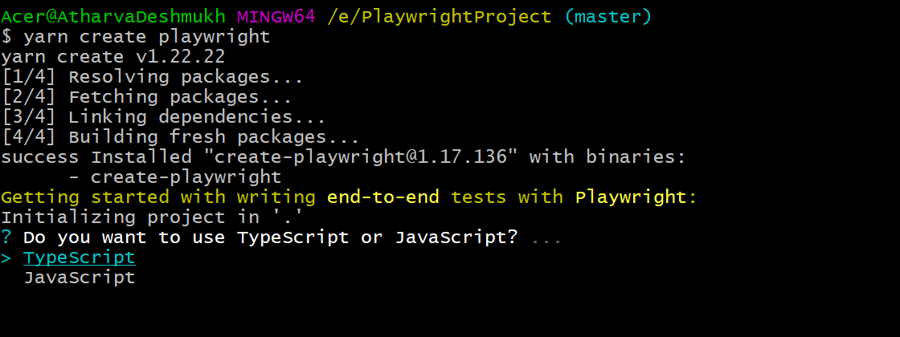

# Installation

- yarn create playwright (choose between TypeScript or JavaScript (default is TypeScript))

- Command to run in UI mode:
  yarn run playwright test --ui

- Specpattern
  Tests are picked from this option in config: testDir: './tests'
